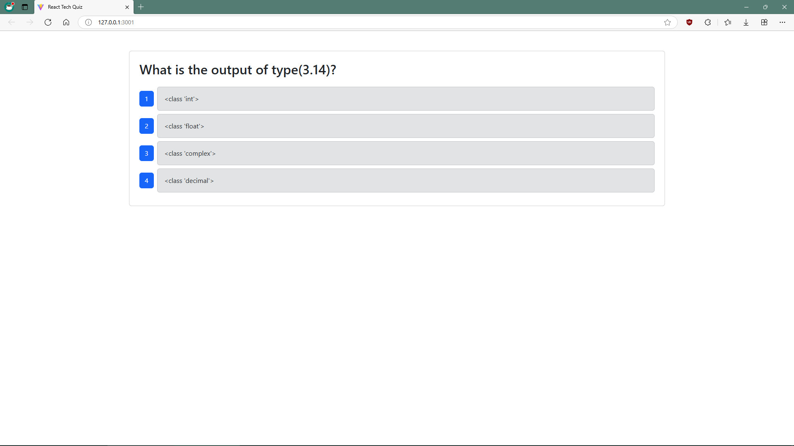

# Tech-Quiz-CM

## Description

A quiz program that allows aspiring developers to test their tech knowledge.

## Table of Contents

- [Installation](#installation)
- [Usage](#usage)
- [Contributing](#contributing)
- [Tests](#tests)
- [Questions](#questions)
- [License](#license)

## Installation

Run the "npm install" script for Node Package Manager to download all of the required dependancy files. Configure the .env file for your system specifications. Run the "npm run build" script to transpile the typescript code into javascript. Execute the "npm run seed" script to seed the MongoDB NoSQL database.

## Usage

Execute the "npm run start:dev" script to start the server. Follow the on-screen prompts to test your tech knowledge.

## Contributing

Contact Christopher Makousky for inqueries on making contributions to this project.

## Tests

Run the "npm run test" script to execute the provided Cypress test schema. Alternatively, the "npm run cypress" script will allow for testing through the Cypress GUI. See the following video for a short demonstration of the test procedure.

[Video Demo]()

    GIVEN I am taking a tech quiz

    WHEN I click the start button
    THEN the quiz starts and I am presented with a question

    WHEN I answer a question
    THEN I am presented with another question

    WHEN all questions are answered
    THEN the quiz is over

    WHEN the quiz is over
    THEN I can view my score

    WHEN the quiz is over
    THEN I can start a new quiz

## Questions

https://github.com/CMakousky

christopher.makousky@gmail.com

## License

MIT License